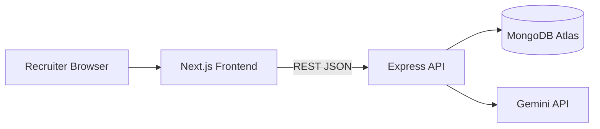

# Axios Frontend Architecture (Next.js)

Recruiter-facing web client for the Umurava AI Hackathon solution: an AI-assisted hiring workflow that ranks applicants while preserving human decision authority.

---

## 1) Product Responsibility

This frontend is responsible for the complete recruiter experience:

- authenticated access and secure session routing
- one-time onboarding for company context
- job creation, update, and deletion flows
- candidate ingestion UX (CSV/Excel and PDF resume upload)
- screening execution and ranked shortlist review
- communication actions (shortlist email dispatch)
- mobile-first, responsive operations dashboard

The frontend never performs final hiring decisions. It presents AI results with explanation so a recruiter remains the final authority.

---

## 2) System Context (Frontend Perspective)



The frontend only consumes API contracts from backend and renders secure, role-appropriate views.

---

## 3) Frontend Technical Stack

- `Next.js 16` (App Router)
- `React 19`
- `TypeScript`
- `Tailwind CSS 4`
- Fetch-based API client with JWT bearer token sourced from cookie

---

## 4) Frontend Architecture

### Route Layers

- Auth pages: `/login`, `/register`, `/forgot-password`, `/reset-password`
- Onboarding page: `/onboarding`
- Dashboard pages: `/`, `/jobs`, `/jobs/create`, `/jobs/[id]`, `/screening/[jobId]`, `/candidates`, `/candidates/[id]`, `/emails`, `/company`

### Access Enforcement

Access control is applied in `proxy.ts`:

- unauthenticated users are redirected to `/login` for protected routes
- authenticated users are redirected away from public auth pages to `/`

### Core Frontend Modules

- `app/lib/api.ts` - typed API wrapper and auth header injection
- `app/lib/errors.ts` - API error extraction for consistent UI messages
- `app/lib/types.ts` - shared domain models used by screens
- `app/components/Sidebar.tsx` - desktop sidebar + mobile bottom navigation
- `app/components/Toast.tsx` - global feedback UX for async operations

---

## 5) Main User Workflows

### A. First Login / Onboarding

1. user authenticates
2. frontend checks `/company/me`
3. no company -> force onboarding
4. existing company -> redirect to dashboard

### B. Job Lifecycle

1. recruiter creates job with scoring config and shortlist target
2. recruiter can update job fields
3. recruiter can delete a job
4. delete action cascades in backend to related candidates/screening data

### C. Candidate Ingestion

1. recruiter selects target job pipeline
2. uploads spreadsheet or PDF
3. frontend streams file to backend endpoints
4. backend parses and persists candidate data

### D. Screening and Decision Support

1. recruiter triggers screening from job detail
2. screening is blocked in UI if no candidates exist
3. results page renders ranked shortlist, scores, and reasoning
4. recruiter uses evidence to decide final shortlist actions

---

## 6) Responsive UX Strategy

The UI is designed for operational usage on laptop and phone:

- container spacing scales with `p-4 / p-6 / p-8`
- action groups stack on mobile and align on larger breakpoints
- data tables use horizontal overflow on small screens
- dense content (screening/candidate detail) collapses into vertical sections on mobile
- navigation switches to bottom tab pattern on small screens

---

## 7) Security and Data Protection (Frontend Layer)

- no direct DB access from client
- protected routes enforced before page render using edge proxy
- all sensitive reads/writes delegated to authenticated backend APIs
- no cross-company filtering logic trusted on client; backend is source of truth

---

## 8) Environment Configuration

Create `.env.local`:

```env
NEXT_PUBLIC_API_URL=http://localhost:5000/api
```

For production, this must target deployed backend URL.

---

## 9) Local Development

```bash
npm install
npm run dev
```

Runs at `http://localhost:3000`.

---

## 10) Production Build and Verification

```bash
npm run lint
npm run build
npm run start
```

Pre-deploy checks:

- lint passes
- production build passes
- auth redirects work as expected
- onboarding lock behavior validated
- core recruiter workflows validated end-to-end

---

## 11) Deployment Guidance (Vercel)

- Framework preset: Next.js
- Set `NEXT_PUBLIC_API_URL`
- Ensure backend CORS allows frontend domain
- Validate that public static assets (logo/backgrounds) resolve on deployed host

---

## 12) Known Non-Application Console Noise

Errors like:

- `Could not establish connection. Receiving end does not exist`
- `Failed to connect to MetaMask`
- `SES Removing unpermitted intrinsics`

are typically injected by browser extensions and not by this application’s code path.

---

## 13) Hackathon Requirement Alignment (Frontend)

- recruiter dashboard present
- job creation/editing/deletion present
- applicant ingestion interfaces present
- AI trigger and shortlist visualization present
- reasoning per candidate visible in screening views
- responsive design implemented for major user journeys
